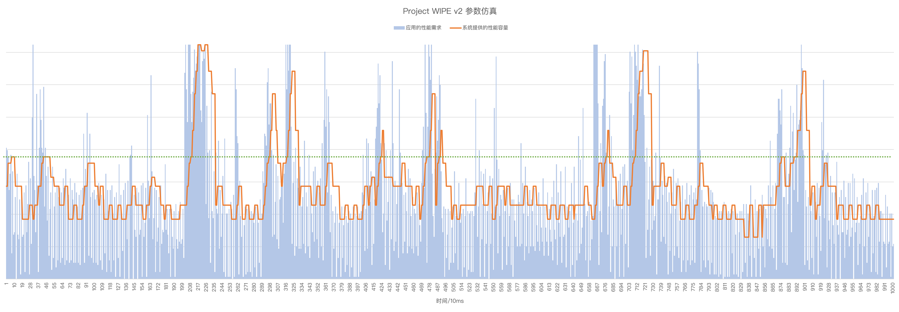

# Project WIPE v2

## 设计目标

本计划旨在通过制作自动化程序，来优化interactive，HMP，inputboost参数：
This project aims to optimize the parameters of interactive, HMP, and inputboost by creating automated programs:

- 现实负载采集(real world workload capture)
- interactive调速器流程仿真(interactive governor process simulation)
- 卡顿和耗电评分函数(cost function of lag and power comsuption)
- 迭代取得局部最优(iteration to obtain local optimum)

相比[Project WIPE v1](https://github.com/yc9559/cpufreq-interactive-opt/)：

1. 支持WALT HMP参数模拟
2. 支持input boost参数模拟
3. 全频率档位支持及可变参数序列长度
4. 毫秒级的负载序列和渲染的性能需求，来自systrace
5. 改进的续航和性能评分函数
6. 启发式优化算法使用NSGA-III
7. 同样的任务量和硬件条件下，优化执行效率提升~450%

## 如何使用

1. 编译发布版本`make release`
2. 修改配置文件`./conf.json`，选择要做优化的CPU模型列表，以及使用的负载序列和参数范围
3. 执行`mkdir output`创建输出文件夹
4. 执行`./wipe`，会自动加载`./conf.json`，并按照列表顺序依次执行优化
5. 到`output`输出文件夹，根据你的流畅度和耗电的要求，在候选中寻找合适的参数组合
6. 本项目在GCC 7.3测试通过

## 包含的第三方库

- [nlohmann/json](https://github.com/nlohmann/json)
- [OpenGA](https://github.com/Arash-codedev/openGA)

## Credit

@TSU守望者
